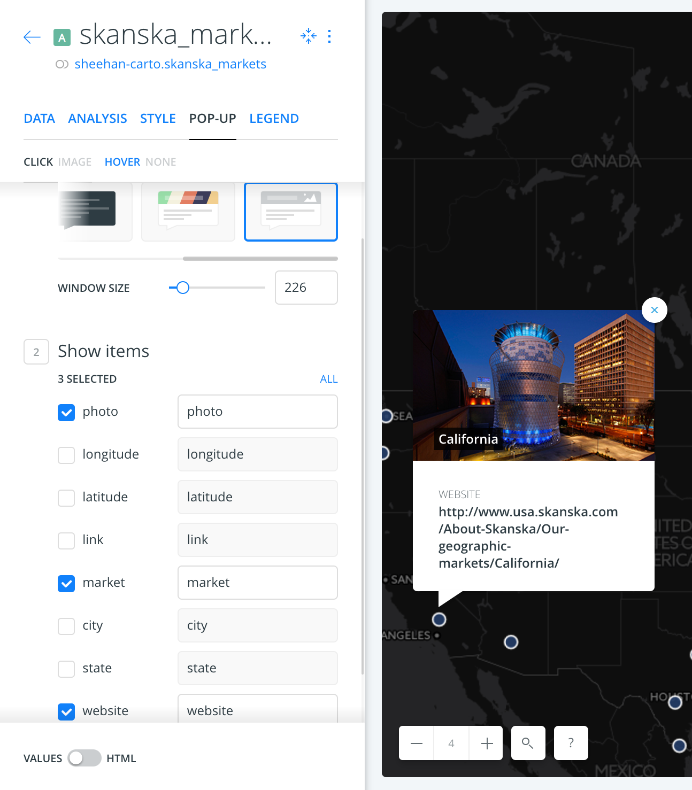

CARTO | Skanska Training Course
============================

You can also find the complete [training course below](#complete).

* Course Main Landing Page: [http://cartodb.github.io/training/introductory/skanska-training.html](http://cartodb.github.io/training/introductory/skanska-training.html)

* Course Materials: [https://github.com/CartoDB/carto-workshop/tree/170119-912-skanska](https://github.com/CartoDB/carto-workshop/tree/170119-912-skanska)

### Requirements 
* Laptop computer with Chrome installed as the browser connected to the internet.
* A CARTO account. For those without an account you can [create a FREE account here](https://carto.com/signup/) and follow along. 

### Training Schedule
Tenative schedule of tasks/talks, subject to change/update.

* **12:00 pm** - [Introduction to CARTO](https://github.com/CartoDB/carto-workshop/tree/170119-912-skanska/00-intro-carto)
* 12:15 pm - [Introduction to Web Mapping/GIS | Skanska](https://docs.google.com/presentation/d/1BG9Ms_9ZdgYtx4yf6928kxRnRncxOY6VvCruqRGQUM0/edit?usp=sharing)
* 12:40 pm - [Introduction to CARTO | Skanska](https://docs.google.com/presentation/d/1HgPzTxQJI5itQxpznHaBQ9reaKTgBi9MXDkYZQMPl7w/edit?usp=sharing)
* **1:00 pm** - Shaking Hands with CARTO, a quick tour of the platform, 
	* Maps/Datasets view, 
	* Inside a CARTO Map 
		* Layers
			* Data
			* Analysis
			* Style
			* Pop-Up
			* Legend
		* Widgets
			* Category
			* Histogram
			* Formula
			* Time-Series
* 1:15 pm - [CARTO Builder Analysis Tools](https://docs.google.com/document/d/1EmuckitxKQFw0vrmoMa0rGk5cCtAEZ_hUFSl0WF9QTQ/edit)
* 1:22 pm - [Carto Docs](https://carto.com/docs)
* 1:30 pm - [Exercise: San Francisco tree map](https://github.com/CartoDB/carto-workshop/blob/170119-912-skanska/01-builder-visualization/exercises/sf-trees.md)
* 1:50 pm - short 10 minute coffee break 
* **2:00** pm - [Making a Skanska Markets Map](#skanska_markets)
* 2:30 pm - [Making a Second Ave Subway Map](#second_ave_subway)
* **3:00 pm** - [Making a Torque Map](#torque)
* 3:15 pm - [Making a Skanska NYC Projects Map](#nyc_projects)
* 3:45 pm - Questions, closing remarks and brainstorming about next steps/project ideas.
* 3:55 pm - Where do I find data???
	* [NYC Open Data](https://nycopendata.socrata.com/)
	* [NYS Open Data](https://data.ny.gov/)
	* Search w/ `GIS`, `Shapefile`, etc.
	* Plus many many more websites which are only a Google search away. Always give yourself ample time for data aquisition and data preparation.
	
If we move very quickly. Here are some **additional exercises** we can work on:

* [Styling Maps: Vintage Map of Africa with CartoCSS](https://github.com/CartoDB/carto-workshop/blob/170119-912-skanska/03-cartography/exercises/africa.md)
* [Market Analysis (Dominos Pizza) Demo](https://github.com/CartoDB/carto-workshop/blob/170119-912-skanska/02-builder-analysis/exercises/dominos.md)

# CARTO Course Materials

## [Introduction to CARTO](00-intro-carto/). 

Introduction to the training sessions, GIS and webmapping and general explanation about CARTO as a platform: product positioning, general overview of the portfolio and examples of how CARTO can solve different use cases.

## [CARTO BUILDER I: Data visualizations and Styling](01-builder-visualization/). 

This course will cover different BUILDER (CARTO's web interface) workflows for generating cartographic data visualizations. We'll dig into new Builder features and some differences with old Editor. During this first part, we'll cover those aspects related to data visualizations, cartographic styles, legend's definition and dashboard creation with actionable Widgets that interact with the map.

## [CARTO BUILDER II: Geospatial analysis and prediction](02-builder-analysis/). 
This advanced workshop will let users know the most powerful analytic capabilities of CARTO BUILDER. Analysis workflows and its link with Widgets will occupy the central part of the course, along with a review of the different analyses that BUILDER currently offers.

## [Cartography and advanced symbology](03-cartography/). 

This session focuses on the advanced use of BUILDER, creating cartographic rules for powerful webmap visualizations. It also goes through our new tools for thematic mapping (TurboCARTO) and all the different options that Torque offers for creating dynamic maps.

## More Resources

#### Map Academy, tutorials and other online resources

* [**Map Academy** courses](https://academy.cartodb.com/).
* [**Tutorials**](https://docs.cartodb.com/tutorials/).
* [Carto Docs](https://carto.com/docs)
* [Other online resources](https://github.com/ramiroaznar/intro-cartodb).

#### Further questions and troubleshooting

* Email to **support@carto.com**.
* Some questions could be already answered at **[GIS Stack Exchange](http://gis.stackexchange.com/questions/tagged/carto)** `carto` tag.

# Skanska-Specific Training 

* [Making a Skanska Markets Map](#skanska_markets)
* [Making a Second Ave Subway Map](#second_ave_subway)
* [Making a Skanska NYC Projects Map](#nyc_projects)
* [Making a Torque Map](#torque)

## Skanksa Markets Map

1. Download the [Skanska Markets dataset](https://team.carto.com/u/sheehan-carto/tables/skanska_markets/public?redirected=true) as a CSV. This data is from [http://www.usa.skanska.com/About-Skanska/Our-geographic-markets/](http://www.usa.skanska.com/About-Skanska/Our-geographic-markets/).

2. Drag the file into your CARTO account **Data** view.

3. Change the **Basemap** to *Dark matter (labels below)*.

4. Style the points to **Fill Size 12**, and with **Skanska** hex color: `#263F6C` (_note may not be official hex value_), and **Stroke Size 1.5 stroke** with **color #FFF**

5. Create an image infowindow using the **POP-UP** settings in the image below. You can drag and drop the selected items so **photo** is at the top. 

6. Next, to activate the link, let's toggle from **VALUES** to **HTML**

7. Now let's set up an html link to the market website in the **infoWindow**. Let's change line 21 from this:

		<h4 class="CDB-infowindow-title">{{website}}</h4>
      
	To this:   

		<h4 class="CDB-infowindow-title"><a href="{{website}}" target='_blank'>{{market}} website</a></h4>
	
8. Add two **Widgets** one for **City** and one for **State**. 
	
9. Publish your map and get your link. 	
	
10. Your Completed Map should look something like this: [https://team.carto.com/u/sheehan-carto/builder/e72b9e4a-d9b0-11e6-9745-0e05a8b3e3d7/](https://team.carto.com/u/sheehan-carto/builder/e72b9e4a-d9b0-11e6-9745-0e05a8b3e3d7/)

## Second Avenue Subway Map

We're going to create this [2nd Avenue Subway 2017 Projected Ridership Change Map](https://team.carto.com/u/sheehan-carto/builder/6a451d3c-ddcc-11e6-84aa-0ecd1babdde5/embed)

1. Download these two data layers and drag into your Carto account
	* [NYC Subway Routes](https://team.carto.com/u/sheehan-carto/tables/nyctsubwayroutes_20170119_2nd_ave_q/public?redirected=true)
	* [NYC Subway Stations Ridership](https://team.carto.com/u/sheehan-carto/dataset/subway_stations_ridership_2010_2015_proj_2017)

2. Set NYC Subway Basemap as XYZ service
viz.json: [https://nygeog.carto.com/api/v2/viz/aa54897a-a187-46ca-a900-792be6c56388/viz.json](https://nygeog.carto.com/api/v2/viz/aa54897a-a187-46ca-a900-792be6c56388/viz.json)

	* Find TPL
	`tpl_aa54897a_a187_46ca_a900_792be6c56388`

	* XYZ Map url template
	`http://nygeog.carto.com/api/v1/map/named/<INSERT_TPL_HERE>/all/{z}/{x}/{y}.png`
	
	* Completed XYZ Map url:
`http://nygeog.carto.com/api/v1/map/named/tpl_aa54897a_a187_46ca_a900_792be6c56388/all/{z}/{x}/{y}.png`

3.  Add Layers
	* `subway_stations_ridership_2010_2015_proj_2017` to your map 3 times (3x)
	* `nyctsubwayroutes_20170119_2nd_ave_q`

4. 2017 Weekday Average Ridership (Projected) SQL

		SELECT * FROM "sheehan-carto".subway_stations_ridership_2010_2015_proj_2017 WHERE lexington = 1 OR secondave = 1

5. 2015 Weekday Average Ridership SQL

		SELECT * FROM "sheehan-carto".subway_stations_ridership_2010_2015_proj_2017 WHERE lexington = 1 
	
6. Subway Stations Background Style
Set color to black.	

7. [MTA Color Guides](http://web.mta.info/developers/resources/line_colors.htm)

8. NYC Subway Line CartoCSS Style

		#layer {
		  line-width: 3;
		  line-color: ramp([route_id], (#0039A6, #0039A6, #FF6319, #6CBE45, #A7A9AC, #808183, #996633, #FCCC0A, #FCCC0A, #FF6319, #EE352E, #FF6319, #EE352E, #EE352E, #00933C, #FCCC0A, #FF6319, #0039A6, #00933C, #00933C, #B933AD, #00A1DE, #666666), ("C","A","D","G","L", "S", "Z", "Q", "R", "F", "3", "M", "1", "2", "6", "N", "B", "E", "5", "4", "7", "Air"), "=");
		}
		
		#layer[route_id='B']{
		    line-offset: -2.0;
		  }
		#layer[route_id='M']{
		    line-offset: -2.0;
		  }
		#layer[route_id='F']{
		    line-offset: -2.0;
		  }
		#layer[route_id='D']{
		    line-offset: -2.0;
		  }
		
		#layer[route_id='1']{
		    line-offset: -2.0;
		  }
		#layer[route_id='2']{
		    line-offset: -2.0;
		  }
		#layer[route_id='3']{
		    line-offset: -2.0;
		  }
		
		#layer[route_id='A']{
		    line-offset: 2.0;
		  }
		#layer[route_id='C']{
		    line-offset: 2.0;
		  }
		#layer[route_id='E']{
		    line-offset: 2.0;
		  }

9. 2017 Weekday Average Ridership (Projected) Style

		#layer {
		  marker-width: ramp([wkd_17_e], range(5, 35), quantiles(10));
		  marker-fill: #EE352E;
		  marker-fill-opacity: 1;
		  marker-allow-overlap: true;
		  marker-line-width: 1;
		  marker-line-color: #FFF;
		  marker-line-opacity: 1;
		}

10. 2015 Weekday Average Ridership Style

		#layer {
		  marker-width: ramp([wkd_15], range(5, 50), quantiles(10));
		  marker-fill: #0039A6;
		  marker-fill-opacity: 1;
		  marker-allow-overlap: true;
		  marker-line-width: 1;
		  marker-line-color: #FFF;
		  marker-line-opacity: 1;
		}
		
11. Advanced - [Rotate the Map w/ `ST_ROTATE`](https://team.carto.com/u/sheehan-carto/builder/081f09b2-dcc1-11e6-b47d-0e3ebc282e83/embed)	

---

## Skanska NYC Projects Map

1. [Download a HERE geocoded version of the Skanska NYC Projects](https://team.carto.com/u/sheehan-carto/dataset/metro_ny_active_project_list_clean_here) and add to your account. 

2. Style the points to **Fill Size 12**, and with **Skanska** hex color: `#263F6C` (_note may not be official hex value_), and **Stroke Size 1.5 stroke** with **color #FFF**

3. Change the Basemap to **Dark matter (labels below)**

4. Set Pop-up Window to all items.

5. Add Widgets for:
	* point count (formula)
	* project_no (category)
	* project_name (category)
	* customer_name (category)
	* account_manager (category)
	* project_manager (category)
	* project_accountant (category)

6. Rename Widgets with capitalization and remove underscores.

7. Compare to [Skanska NYC Projects Map](https://team.carto.com/u/sheehan-carto/builder/8953430a-de55-11e6-bcb5-0e233c30368f/embed?state=%7B%22map%22%3A%7B%22ne%22%3A%5B40.505968368969036%2C-74.33624267578125%5D%2C%22sw%22%3A%5B40.87873731327488%2C-73.61732482910156%5D%7D%7D)

 

## Skanks Torque Map - RunKeeper Data

1. [Download these **RunKeeper** points](https://dms2203.carto.com/tables/runkeeper_points) and add as layer 2 times.

2. Change Basemap to Satellite Imagery

3. **SQL Statement to select date range**

		SELECT * FROM runkeeper_points 
		WHERE time > '06/29/2015' AND time <= '06/30/2015' 

4. Style for Animated Layer

		/** torque visualization */
		
		Map {
		-torque-frame-count:1024;
		-torque-animation-duration:45;
		-torque-time-attribute:"time";
		-torque-aggregation-function:"count(cartodb_id)";
		-torque-resolution:1;
		-torque-data-aggregation:cumulative;
		}
		
		#runkeeper_points{
		  comp-op: lighter;
		  marker-fill-opacity: 0.9;
		  marker-line-color: #FFF;
		  marker-line-width: 0;
		  marker-line-opacity: 1;
		  marker-type: ellipse;
		  marker-width: 6;
		  marker-fill: #FF2900;
		}
		#runkeeper_points[frame-offset=1] {
		 marker-width:8;
		 marker-fill-opacity:0.45; 
		}

5. Style for Background Layer

		/** simple visualization */
	
		#runkeeper_points{
		  marker-fill-opacity: 0.2;
		  marker-line-color: #000000;
		  marker-line-width: 1;
		  marker-line-opacity: 1;
		  marker-placement: point;
		  marker-type: ellipse;
		  marker-width: 10;
		  marker-fill: #778899;
		  marker-allow-overlap: true;
		  marker-comp-op: darken;
		}

CARTO complete Training Course
============================
This link provides access to our full-week intensive training.

## [http://bit.ly/carto-workshop](http://bit.ly/carto-workshop)
